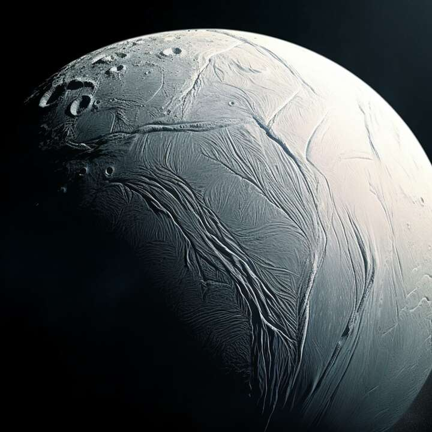
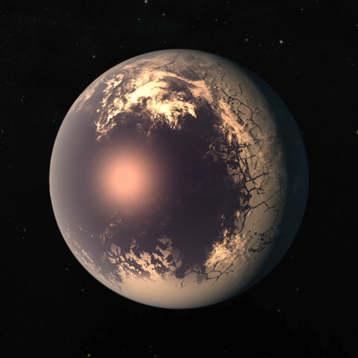

 

I'm now a postdoctoral associate in EAPS at MIT.

My research focuses on hydrothermal plumes within the subglacial oceans of icy moons, notably Europa and Enceladus. These icy moons are believed to harbor oceans extending tens of kilometers beneath an icy shell. Geothermal activity at the seafloor can drive plumes, interacting with the ambient fluid. These processes play a pivotal role in shaping heat and tracer transport dynamics within the ocean.

I am also interested in the fluid dynamics and climates on tidally locked planets beyond the solar system. My doctoral research focuses on the superrotation, global overturning circulation, and energy cycle on such planets. Better understanding on these aspects can help us predict the habitability of these candidate planets.
